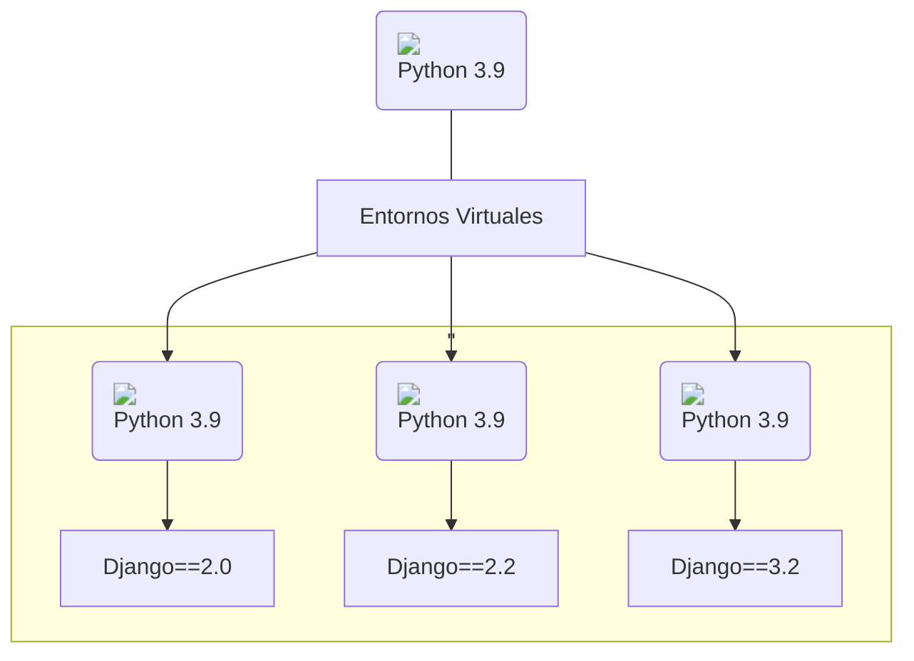

# Configurar un Entorno Virtual


Cuando instalamos [Python3](https://www.python.org/ "Sitio web de Python"){:target='blank'}, se crea un único entorno global compartido por todos los proyectos y todo el código de Python. Aunque es posible instalar [Django](https://www.djangoproject.com/ "Sitio web de Django"){:target=':_blank'} y otros paquetes en el entorno global, esto limita la posibilidad de gestionar múltiples versiones de cada paquete.

!!! warning "Cuidado"

    Los paquetes o bibliotecas instalados en el entorno global de Python pueden **entrar en conflicto potencialmente entre sí**, especialmente si dependen de diferentes versiones del mismo paquete. Esto puede ser un problema si quieres crear en el futuro nuevos sitios (usando la útima versión de un paquete) pero manteniendo proyectos que dependen de versiones más antiguas.


Como resultado, los desarrolladores experimentados suelen configuran y ejecutan las aplicaciones Python dentro de [entornos virtuales Python](https://docs.python.org/es/3/tutorial/venv.html){:target='blank'} independientes.


<div style="text-align:center" class="mermaid-container">
<div class="mermaid-title">Esquema de Entornos Virtuales de Python</div>

</div>

## **Paquetes para Configurar un Entorno Virtual**

Una vez instalados Python y pip, contamos con paquetes que nos permiten configurar entornos virtuales. Algunos de estos paquetes vienen integrados con Python, como [`venv`](https://docs.python.org/es/3.13/library/venv.html){:target='_blank'}, mientras que otros, como [`virtualenv`](https://pypi.org/project/virtualenv/){:target='_blank'}, deben instalarse por separado. Ambos nos facilitan la creación de entornos aislados para nuestros proyectos, evitando conflictos entre dependencias.

### **Administrar entornos con `virtualenvwrapper`**

Este paquete es una extensión de `virtualenv` que facilita la gestión y organiza todos tus entornos virtuales en un solo lugar. Para instalarlo, ejecuta el siguiente comando:

=== ":material-apple: macOS"

	```bash title="terminal"
	pip3 install virtualenvwrapper
	```

=== ":simple-linux: Linux"

	```bash title="terminal"
	sudo pip3 install virtualenvwrapper
	```


Ahora, añade las siguientes líneas en el archivo de inicio del shell (`.bashrc` o `.zshrc` si usas [zsh](https://en.wikipedia.org/wiki/Z_shell)):

=== ":octicons-file-code-16: `.bashrc`"
	```bash hl_lines="1 3"
	export WORKON_HOME=$HOME/.virtualenvs # (1)!
	export VIRTUALENVWRAPPER_PYTHON=/usr/bin/python3
	source /usr/local/bin/virtualenvwrapper.sh #(2)!
	```

	1.  La variable `WORKON_HOME` determina en qué directorio se deben crear los entornos virtuales de Python.
	
	2. Por último, se debe agregar esta línea al archivo `~/.bashrc` para especificar en dónde está ubicado el ejecutable de virtualenvwrapper.

#### **Comandos adicionales**

`virtualenvwrapper` agrega varios comandos útiles para gestionar entornos virtuales de manera más eficiente. Algunos de los más utilizados son:

- `mkvirtualenv`: Crea un nuevo entorno virtual.
- `lsvirtualenv`: Muestra todos los entornos virtuales existentes.
- `workon`: Permite activar fácilmente cualquier entorno virtual.
- `rmvirtualenv`: Elimina un entorno virtual.
- `deactivate`: Desactiva el entorno virtual activo.

#### **1. Crear un entorno virtual**

```bash title="terminal"
mkvirtualenv nombre_entorno
```

#### **2. Activar un entorno virtual**


=== "Activar el entorno"

	```bash title="terminal"
	workon django-test
	```
=== "Salida"

	```title="terminal"
	created virtual environment CPython3.9.2.final.0-64 in 9185ms
	  creator CPython3Posix(dest=/home/enidev911/.virtualenvs/django-test, clear=False, no_vcs_ignore=False, global=False)
	  seeder FromAppData(download=False, pip=bundle, setuptools=bundle, wheel=bundle, via=copy, app_data_dir=/home/enidev911/.local/share/virtualenv)
	    added seed packages: pip==24.1, setuptools==70.1.0, wheel==0.43.0
	  activators BashActivator,CShellActivator,FishActivator,NushellActivator,PowerShellActivator,PythonActivator
	virtualenvwrapper.user_scripts creating /home/enidev911/.virtualenvs/django-test/bin/predeactivate
	virtualenvwrapper.user_scripts creating /home/enidev911/.virtualenvs/django-test/bin/postdeactivate
	virtualenvwrapper.user_scripts creating /home/enidev911/.virtualenvs/django-test/bin/preactivate
	virtualenvwrapper.user_scripts creating /home/enidev911/.virtualenvs/django-test/bin/postactivate
	virtualenvwrapper.user_scripts creating /home/enidev911/.virtualenvs/django-test/bin/get_env_detail
	```

#### **3. Eliminar un entorno virtual**


```bash title="bash"
rmvirtualenv nombre_entorno
```